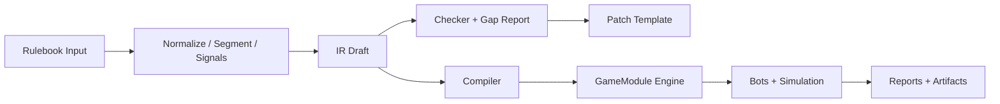
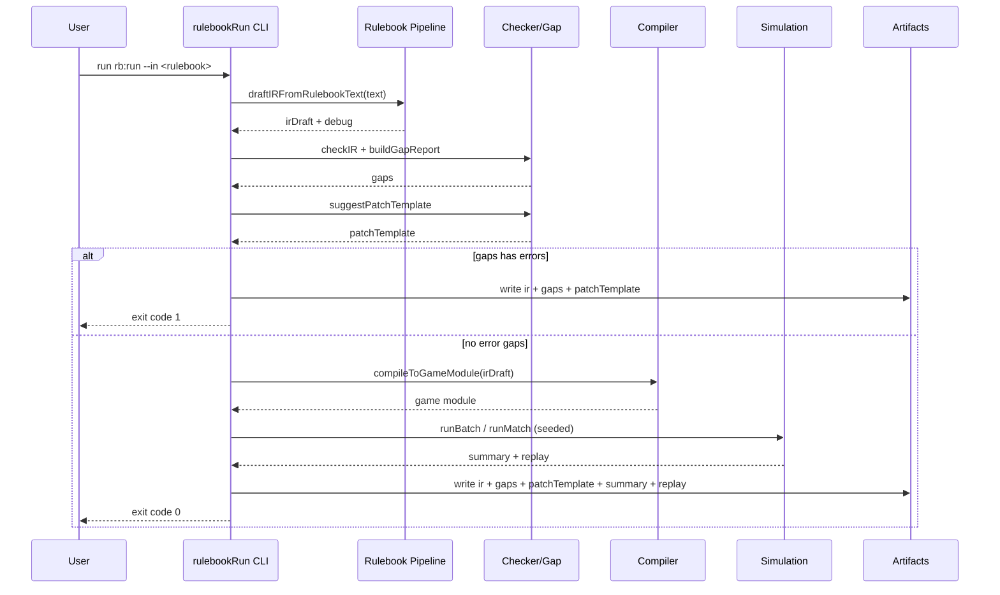

# Architecture

## High-Level Components



## Sequence: `rb:run` Pipeline



## Data Model

```mermaid
classDiagram
  class GameIRv0 {
    +meta
    +rng
    +state
    +turn
    +actions
    +end
    +scoring
    +invariants
  }

  class IRPatch {
    +operations[]
  }

  class GapReport {
    +gaps[]
    +summary{errors,warnings}
    +notes[]
  }

  class ReplayEvent {
    +index
    +seed
    +turn
    +actor
    +action
    +stateHashBefore
    +stateHashAfter
  }

  class BatchSummary {
    +matches
    +winRates
    +averageTurns
    +actionDistribution
  }

  GameIRv0 --> IRPatch : fixed by
  GameIRv0 --> GapReport : validated by
  GameIRv0 --> ReplayEvent : compiled runtime emits
  ReplayEvent --> BatchSummary : aggregated into
```
