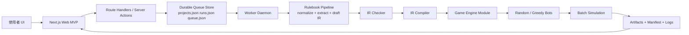
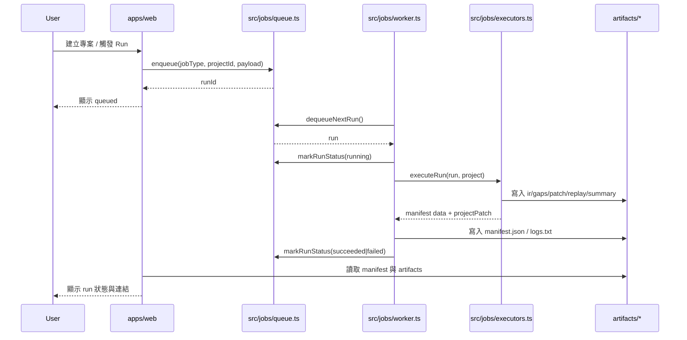
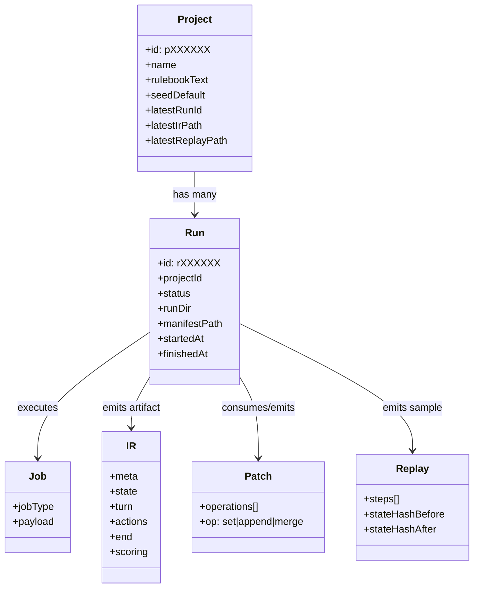

# 系統架構

本文件描述目前程式碼已實作的主要組件、任務流程與核心資料模型。

## 1) 元件圖（Component Diagram）

## 2) 任務序列圖（Job-based Run）

## 3) 資料模型圖（Project / Run / Job / IR / Patch / Replay）

## 4) 實作對照

- Queue/Store：`src/jobs/queue.ts`, `src/jobs/store.ts`
- Worker：`src/jobs/worker.ts`, `scripts/workerDaemon.ts`
- Executor：`src/jobs/executors.ts`
- Web API：`apps/web/app/api/**/route.ts`
- Artifacts：`artifacts/jobs/*`、`artifacts/projects/*`
